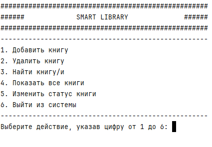
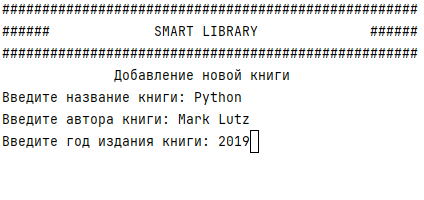
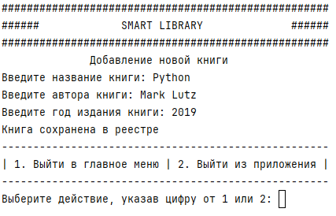
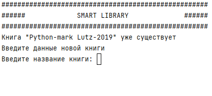
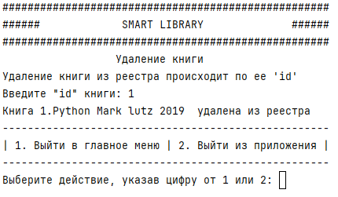
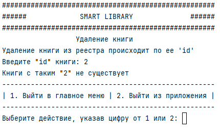
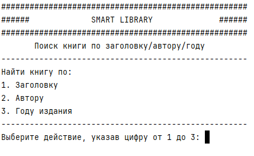

# SmartLibrary

## Описание
Консольное приложение для управления библиотекой книг.

Приложение позволяет добавлять, удалять, искать и отображать книги.

# Запуск приложения

> Загрузка проекта
```bash
https://github.com/Aroptich/SmartLibrary.git
cd SmartLibrary
```

> Запуск приложения

В терменале необходимо ввести следующую команду
```bash
python app.py
```

### **Вид главного меню**

Управление приложением осуществляется с клавиатуры



### **Добавить книгу**

В разделе "Добавить книгу" необходимо ввести название, 

автора и год издания книги



При правильном заполнении всех полей появиться сообщение о том, 

что "книга сохранена в реестре".

После успешного добавления книги программа попросит пользователя выбрать дальнейшие действия.



При добавлении книги, которая уже находится в реестре будет выдано сообщении о том, 

что такая книга уже существует и попросит пользователя ввести данные книги заново



### **Удалить книгу**

При удалении книги, пользователь должен ввести 'id' книги.
Если 'id', который указал пользователь существует, то произойдет успешное удаление книги,




а если 'id' будет указан не верно, то прилодение выдаст сообщение, 

что книги с таким 'id' в реесрте нет




### **Найти книгу/и**

Поиск книг/и осуществляется или по заголову или по автору или по году издания.

Пользователю необходимо выбрать один из 3 вариантов



Для поиска книги например по заголовку пользователь должен ввести полное название книги. 

При совпадении заголовка, который ввел пользователь с названием книги из БД, пользователь


